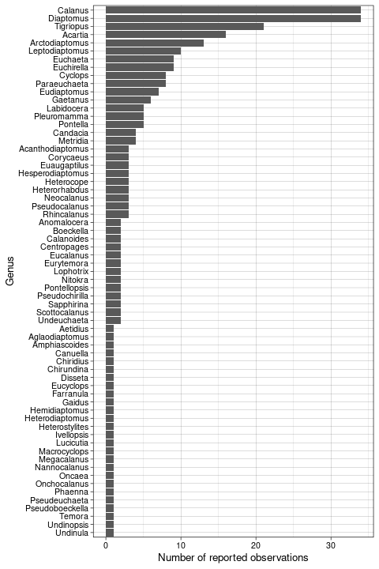
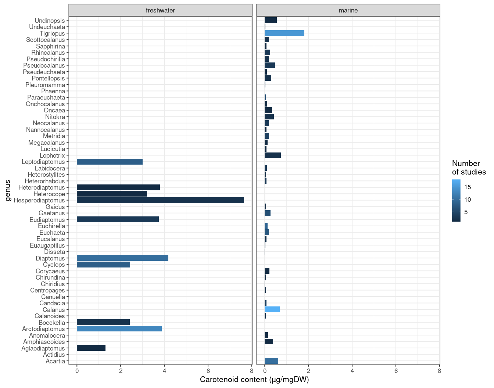
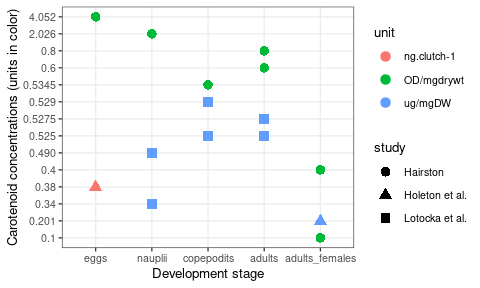
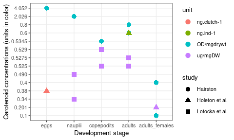
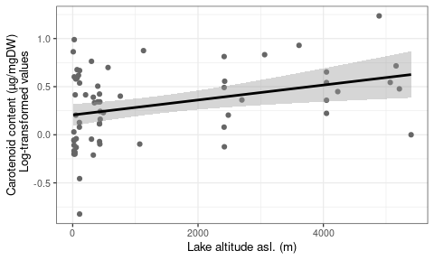
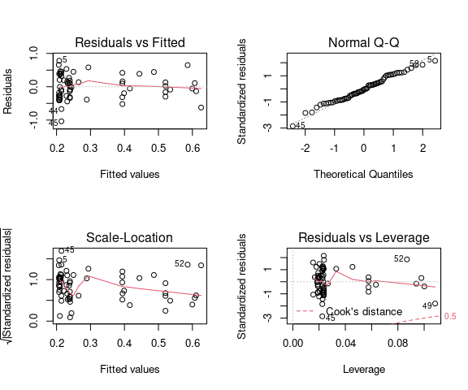
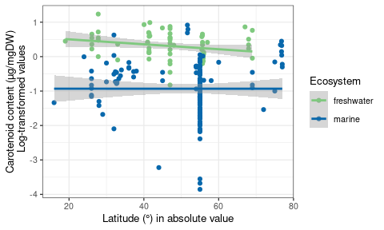
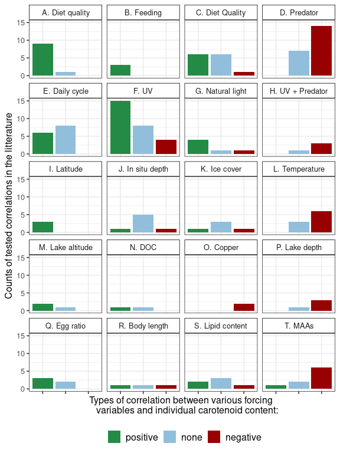
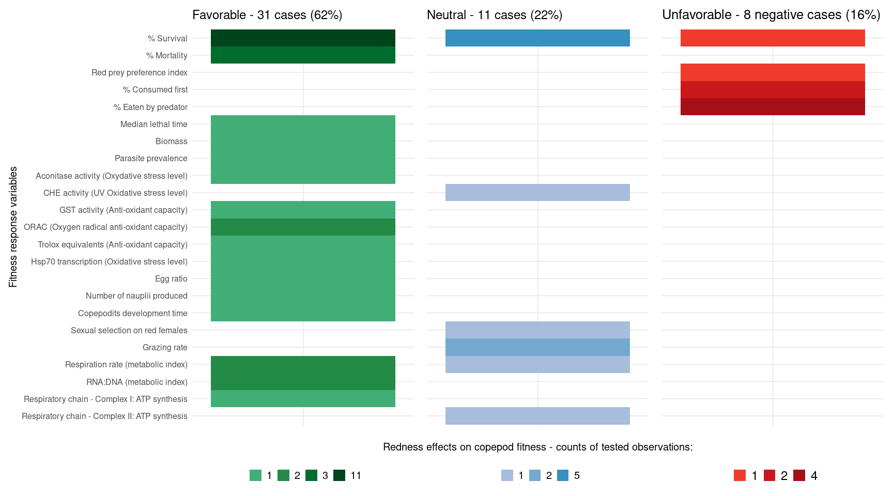

Copepods’ true colors: astaxanthin pigmentation as an indicator of
fitness
================
Laure Vilgrain - March 2021

# 0. Read data

**Suppl. Data SI.** List of all the publications that discussed and/or
quantified carotenoid pigmentation in copepods

``` r
SI <- read_delim("DataS1_general_info.csv", ";", escape_double = FALSE, trim_ws = TRUE)
SI
```

    # A tibble: 316 × 24
       study             year no    study_type latitude longitude ecosystem altitude
       <chr>            <dbl> <chr> <chr>         <dbl>     <dbl> <chr>        <dbl>
     1 Gorokhova et al.  2013 <NA>  redness a…     59         25  marine          NA
     2 Gorokhova et al.  2013 <NA>  redness a…     59         25  marine          NA
     3 Anderson et al.   2003 <NA>  diet effe…     54         12  marine          NA
     4 Hairston          1976 <NA>  redness a…     47.4     -120. freshwat…      328
     5 Hairston          1976 <NA>  redness a…     47.5     -120. freshwat…      328
     6 Bandaranayake a…  1982 <NA>  pigment i…    -18.5      147  marine          NA
     7 Bandaranayake a…  1982 <NA>  pigment i…    -18.5      147  marine          NA
     8 Bandaranayake a…  1982 <NA>  pigment i…    -18.5      147  marine          NA
     9 Bandaranayake a…  1982 <NA>  pigment i…    -18.5      147  marine          NA
    10 Byron             1982 <NA>  forcing v…     40       -105  freshwat…     3216
    # … with 306 more rows, and 16 more variables: sampling_month <chr>,
    #   genus <chr>, species <chr>, stage <chr>, astaxanthin_or_carotenoids <chr>,
    #   astaxanthin_on_total_car <chr>, asta_form <chr>, concentration <chr>,
    #   unit <chr>, unit_conversion <chr>, daily_pic_moment <chr>,
    #   seasonal_pic_season <chr>, seasonal_pic_month <chr>,
    #   predator_abundance <chr>, blue_color <chr>, comments <chr>

<br/> **Suppl. Data SII.** List of the detailed quantifications of
carotenoids forms in copepods found in 38 articles from the literature

``` r
SII <- read_delim("DataS2_asta_form_detailed.csv", ";", escape_double = FALSE, trim_ws = TRUE)
SII
```

    # A tibble: 38 × 11
       study            year order latitude ecosystem species stage free  all_esters
       <chr>           <dbl> <chr>    <dbl> <chr>     <chr>   <chr> <chr> <chr>     
     1 Anderson et al.  2003 <NA>        54 marine    Acarti… mixed 72    30        
     2 Bandaranayake …  1982 <NA>      -185 marine    Temora… mixed mino… dominant  
     3 Bandaranayake …  1982 <NA>      -185 marine    Centro… mixed mino… dominant  
     4 Bandaranayake …  1982 <NA>      -185 marine    Undinu… mixed mino… dominant  
     5 Bandaranayake …  1982 <NA>      -185 marine    Euchae… mixed domi… minority  
     6 Foss et al.      1987 <NA>        62 marine    Calanu… adul… 11    89        
     7 Goodwin and Sr…  1949 <NA>        53 marine    Tigrio… adul… domi… minority  
     8 Holeton et al.   2009 <NA>        58 marine    Acarti… adul… 55    45        
     9 Juhl et al.      1996 <NA>        32 marine    Calanu… adul… 15    85        
    10 Juhl et al.      1996 <NA>        34 marine    Calanu… adul… 15    85        
    # … with 28 more rows, and 2 more variables: `mono-esters` <dbl>,
    #   `di-esters` <dbl>

<br/> **Suppl. Data SIII.** Abiotic and biotic variables effects on
copepod astaxanthin concentrations from the literature

``` r
SIII <- read_delim("DataS3_forcing_variables.csv", ";", escape_double = FALSE, trim_ws = TRUE)
SIII
```

    # A tibble: 181 × 8
       study       year order condition forcing_variable asta_correlation confidence
       <chr>      <dbl> <chr> <chr>     <chr>            <chr>            <chr>     
     1 Anderson …  2003 <NA>  mesocosm  diet_composition positive         high      
     2 Anderson …  2003 <NA>  mesocosm  diet_quantity    positive         high      
     3 Anderson …  2003 <NA>  mesocosm  feeding_activity positive         high      
     4 Anderson …  2003 <NA>  mesocosm  diurnal_variati… positive         high      
     5 Byron       1982 <NA>  in vivo   lake_elevation   positive         high      
     6 Byron       1982 <NA>  in vivo   lake_depth       negative         high      
     7 Byron       1982 <NA>  in vivo   UV_radiations    negative         high      
     8 Byron       1982 <NA>  in vivo   temperature      negative         high      
     9 Byron       1982 <NA>  in vivo   diet_quantity    none             high      
    10 Byron       1982 <NA>  in vivo   fish_presence    negative         medium    
    # … with 171 more rows, and 1 more variable: comments <chr>

<br/> **Suppl. Data SIV.** List of the effects of carotenoid
pigmentation on fitness-related variables in copepods

``` r
SIV <- read_delim("DataS4_fitness_effects.csv", ";", escape_double = FALSE, trim_ws = TRUE)
SIV
```

    # A tibble: 55 × 11
       study            year  condition forcing_variable response_variable     unit 
       <chr>            <chr> <chr>     <chr>            <chr>                 <chr>
     1 Gorokhova et al. 2013  in vivo   <NA>             Grazing rate          ugC …
     2 Gorokhova et al. 2013  in vivo   <NA>             Egg ratio             egg …
     3 Gorokhova et al. 2013  in vivo   <NA>             RNA:DNA (metabolic i… <NA> 
     4 Gorokhova et al. 2013  in vivo   <NA>             ORAC (Oxygen radical… uM T…
     5 Gorokhova et al. 2013  in vitro  <NA>             % Eaten by predator   prey…
     6 Gorokhova et al. 2013  in vitro  <NA>             Red prey preference … Manl…
     7 Gorokhova et al. 2013  in vitro  <NA>             Grazing rate          ugC …
     8 Gorokhova et al. 2013  in vitro  <NA>             RNA:DNA (metabolic i… <NA> 
     9 Gorokhova et al. 2013  in vitro  <NA>             ORAC (Oxygen radical… uM T…
    10 Hairston         1976  in vitro  UV_radiations    % Survival            <NA> 
    # … with 45 more rows, and 5 more variables: fitness_component <chr>,
    #   fitness_effect <chr>, confidence <chr>, graph_order <dbl>, comments <chr>

<br/> <br/>

# I. Carotenoid pigmentation in copepods

## A. A shared and conserved functional trait in copepods

### *Studies*

``` r
# Counts of all studies 
(SI %>% distinct(study, year, no) %>% nrow())
#-> 95

# Counts of studies with quantification of carotenoids
SI %>% filter(str_detect(study_type, "no_quantification", negate = T)) %>% distinct(study, year, no)  %>% nrow()
#-> 70

# Ratio between both
(SI %>% filter(str_detect(study_type, "no_quantification", negate = T)) %>% distinct(study, year, no)  %>% nrow()) / (SI %>% distinct(study, year, no) %>% nrow())
# -> 0.74
```

<div style="background-color: #bbe1e0">

**95 articles** contain the words ’copepods” and “carotenoid”,
“astaxanthin” or “redness”, and have observed blue or red copepods in
marine or freshwater ecosystems. Among them, **70 studies (74%)
quantified carotenoids** (in various units and methods).

</div>

### *Genus and species*

``` r
# Number of species
SI %>% group_by(species) %>% summarise() %>% nrow()
# -> 171

# Number of genus
SI %>% filter(genus != "mixed") %>% group_by(genus) %>% summarise() %>% nrow()
# -> 65
```

``` r
# Most studied genus 
SI %>% filter(genus != "mixed") %>% 
  ggplot() + 
  geom_bar(aes(y=fct_rev(fct_infreq(genus))))+
  labs(y="Genus", x= "Number of reported observations")+theme_linedraw(base_size = 10)
```



<div style="background-color: #bbe1e0">

Carotenoids were observed in **171 species among 65 genus** (we removed
case where genus are mixed together, noted as “mixed”). We can see that
*Diaptomus* and *Calanus* species are the most studied.

</div>

<br/> In some articles, carotenoid pigmentation was just discussed in
the text of the article but not quantified, so we indicated
“no_quantification” in the “study_type” column. **For following
analyses, only studies that quantified carotenoids will be used:**

``` r
SI_obs_and_quanti <- SI
SI_obs_and_quanti %>% distinct(study, year, no, latitude, longitude) %>% nrow()
# -> pigmentation (red or blue) was observed at 154 locations globally
SI_obs_and_quanti %>% nrow()
# -> 316 observations

# Keep only quantitative measures
SI <- SI %>% filter(str_detect(study_type, "no_quantification", negate = TRUE))
SI %>% distinct(study, year, no, latitude, longitude) %>% nrow()
# -> 128 locations
SI %>% nrow()
# -> 286 observations
```

<div style="background-color: #bbe1e0">

Red or blue pigmentation of copepod was reported in **154 locations
globally** for 316 observations. However, if we remove the 30 studies
that reported or analysed pigmentation without a quantitative approach,
we obtain **286 measurements of pigments** (combinations
study/latitude/longitude/altitude/species/stages) at 128 locations.
<br/>

</div>

<br/>

### *Units*

``` r
SI %>% group_by(unit, unit_conversion) %>% summarise(nb_of_studies_using_this_unit = n()) %>% arrange(-nb_of_studies_using_this_unit) %>% ungroup() 
```

    # A tibble: 19 × 3
       unit                                         unit_conversion nb_of_studies_u…
       <chr>                                        <chr>                      <int>
     1 ug/mgDW                                      no                           202
     2 OD/mgdrywt                                   no                            22
     3 <NA>                                         no                            11
     4 ng.ind-1                                     no                             9
     5 ug/mgDW                                      yes                            9
     6 % of copepod with red antennules             no                             8
     7 a*, b* channel color value                   no                             5
     8 A/mg                                         no                             3
     9 ug/mgLW                                      no                             3
    10 %red pixel geninal somite, %redness antennae no                             2
    11 ng.clutch-1                                  no                             2
    12 ng.ugC-1                                     no                             2
    13 OD/gdrywt                                    no                             2
    14 mean grey value                              no                             1
    15 ng.egg-1                                     no                             1
    16 OD/ind                                       no                             1
    17 pmol.ind-1                                   no                             1
    18 ug.egg-1                                     no                             1
    19 umol.molC-1                                  no                             1

``` r
#%>% write_xlsx("Summary_units.xlsx")
```

<div style="background-color: #bbe1e0">

Among the **286 quantifications the most common unit was µg/mgDW (202
measurements)**. 11 NA are present because for 5 studies, carotenoids
were quantified to distinguish proportions of various pigments forms but
no value of total carotenoid content was provided. 9 measurements have
been successfully converted into µg/mgDW. We were not able to convert
the other 64 values because of the method used (ex: mixed species or
development stages, missing information, new methods not comparable).
All details of conversions are given in Appendix 1: Table S1. Finally,
**211 values in µg/mgDW** will be used for all following quantitative
comparisons.

</div>

<br/>

### *Freshwater vs marine ecosystems*

``` r
# Filter measurments in µg/mgDW
ug <- SI %>% filter (unit == "ug/mgDW")

# Transform to have numeric values 
ug$concentration <- as.numeric(ug$concentration)

# Total carotenoid average 
mean(ug$concentration)
```

    [1] 1.217038

``` r
# -> 1.22

# Count number of studies by ecosystems 
ug %>% group_by(ecosystem) %>% summarise(counts = n(), `median concentration` = median(concentration)) %>% ungroup()
```

    # A tibble: 2 × 3
      ecosystem  counts `median concentration`
      <chr>       <int>                  <dbl>
    1 freshwater     66                  2.24 
    2 marine        145                  0.137

Global average carotenoid concentrationfrom 211 measurments is 1.22
µg.mgDW-1.

``` r
# Density distributions of pigment concentrations in freshwater and marine ecosystems: 
pigment_dd <- ug %>% 
  ggplot +
  #geom_histogram(aes(x = mean, fill = ecosystem, color = ecosystem), alpha =0.85)+
  geom_density(aes(x = concentration, fill = ecosystem, color = ecosystem), alpha =0.85)+
  #scale_x_continuous(trans='log10')+
  scale_x_log10(breaks = trans_breaks("log10",  function(x) 10^x),
             labels = trans_format("log10", math_format(10^.x))) +
  annotation_logticks(sides="b")+
  labs(x="Carotenoids concentration (μg/mgDW)",
       y="Density",
       fill= "Ecosystem")+
  theme_bw(base_size=22)+
  ylim(0,1.5)+
  theme(legend.position = "none", panel.grid.minor = element_blank())+
  scale_fill_manual(values=c("#7fc97f","#0868ac"))+
  scale_color_manual(values=c("#7fc97f","#0868ac"))+
  geom_vline(xintercept = median(filter(ug, ecosystem == "marine")$concentration), linetype="dotted", 
                color = "#0868ac", size=1)+
  geom_vline(xintercept = median(filter(ug, ecosystem == "freshwater")$concentration), linetype="dotted", 
                color = "#7fc97f", size=1)


# World map with locations of pigmented copepod observations: 

# Create a dataframe with locations of all studies (not only quantifications because observation is enough)
locations <- SI_obs_and_quanti %>% distinct(study, year, no, latitude, longitude, ecosystem, blue_color) %>% ungroup()


# Project the studies locations 
loc_proj <- st_as_sf(filter(locations, is.na(latitude) == FALSE), coords = c("longitude", "latitude"), 
    crs = 4032, agr = "constant")

# Find coastlines and borders
world <- ne_countries(scale = "medium", returnclass = "sf")

# Plot the map 
world_map <- ggplot(data = world) +
  geom_sf(size=0.05)+ #plot the world map 
  geom_sf(data = loc_proj, size = 2, alpha = 0.85, aes(color = ecosystem, shape= ecosystem))+ #project data points
  #geom_sf(data = filter(loc_proj, blue_color == "yes"), size = 0.8, alpha = 1, color= "#66FFFF")+ #project data points
  #geom_sf(data = filter(loc_proj, blue_color == "no"), size = 0.5, alpha = 1, color= "#CC0000")+ #project data points
  coord_sf(crs = "+proj=laea +lat_0=42 +lon_0=10 +x_0=4321000 +y_0=3210000 +ellps=GRS80 +units=m +no_defs ")+ #spherical projection
  labs(color= "Ecosystem", shape = "Ecosystem")+
  scale_color_manual(values=c( "#7fc97f", "#0868ac"))+
  theme_minimal(base_size=20)+
  theme(legend.position = c(1.72, 0.8))

ggdraw(pigment_dd) +  draw_plot(world_map, width =0.75, height =0.75, 
        x = -0.04, y = 0.24)
```


``` r
#ggsave("map_and_density.pdf", width=18, height =11)
```

<div style="background-color: #bbe1e0">

The inset map shows the 154 locations where carotenoid-based
pigmentation have been observerd (blue or red). Disctributions of
carotenoids contents were done with the 214 values expressed in
µg.mgDW-1. Fweeshwater copepods have an median carotenoid concentration
of **2.243 µg.mgDW-1 (n=66)** and marine species a median carotenoid
concentration of **0.137µg.mgDW-1 (n=145)**.

</div>

<br/> <br/>

We performed statisical tests to compare carotenoid mean concentrations
between freshwater and marine ecosystems

``` r
ug$ecosystem = factor(ug$ecosystem, levels = c("freshwater", "marine"))

# First, test of normal distribution of data 
shapiro.test(filter(ug, ecosystem =="freshwater")$concentration)
# -> W = 0.76516, p-value = 6.513e-09
shapiro.test(filter(ug, ecosystem =="marine")$concentration)
# -> W = 0.39191, p-value < 2.2e-16
```

-> concentrations are not normally distributed

``` r
ug$concentration_log10 <- log10(ug$concentration)
# -> log transformation

shapiro.test(filter(ug, ecosystem =="freshwater")$concentration_log10)
# -> W = 0.98421, p-value = 0.5655 : normal distribution
shapiro.test(filter(ug, ecosystem =="marine")$concentration_log10)
# -> W = 0.9587, p-value = 0.0003215
# -> log-transformed marine concentrations are still not normal after transformation

leveneTest( log10(concentration) ~ ecosystem, data = ug, alternative = "two.sided" )
# Df F value   Pr(>F)   
#1  16.172 8.079e-05 ***
```

-> log-transformed marine concentrations were **still not normal, and
variances are not equal**, so we will use a non-parametric test

``` r
# So we can use a non-parametric test: 
wilcox.test(filter(ug, ecosystem =="marine")$concentration_log10, filter(ug, ecosystem =="freshwater")$concentration_log10, alternative = "two.sided")
```


        Wilcoxon rank sum test with continuity correction

    data:  filter(ug, ecosystem == "marine")$concentration_log10 and filter(ug, ecosystem == "freshwater")$concentration_log10
    W = 572, p-value < 2.2e-16
    alternative hypothesis: true location shift is not equal to 0

``` r
# -> significantly different 
```

<div style="background-color: #bbe1e0">

Freshwater and marine carotenoid concentrations are **significantly
different** using a Wilcoxon rank sum test. We can then observe mean
concentration differences between copepod genus:

</div>

``` r
ug %>% filter(genus != "mixed") %>% 
  group_by(genus, ecosystem) %>% 
  summarise(nb_studies = n(), pigment_content = mean(concentration), sd = sd(concentration)) %>% 
  ungroup() %>% 
  ggplot() + 
  geom_bar(aes(pigment_content, genus, fill = nb_studies), stat ="identity")+
  facet_wrap(~ecosystem)+
  labs(x="Carotenoid content (µg/mgDW)", fill = "Number 
of studies")+
  theme_bw(base_size = 16)
```



``` r
ggsave("fig_sup/Fig S1.png", width=10, height =10)
```

<br/>

<div style="background-color: #bbe1e0">

Plenty of copepod genus have the availability to synthesize astaxanthin
but their propensity to do so seems mediated by the environment where
they live. Note that then marine species accumulating the more pigments
are *Tigriopus sp.* living in shallow temperate waters (ex: tidal pools
of rocky shores) and *Calanus spp.* living in arctic and subarctic
waters, submitted to strong seasonal climate variations.

</div>

<br/>

## B. Localisation, molecular forms and metabolism of carotenoids pigments

### *Copepods’ carotenoids types (astaxanthin, canthaxanthin, etc)*

``` r
# Number of studies that quantified the different types of carotenoids in copepods
detailed_carotenoids <- SI %>% filter(!is.na(astaxanthin_on_total_car)) 
detailed_carotenoids %>% group_by(study, year, no) %>% summarise(obs = n()) %>% nrow()
# -> 32 studies 

asta_car <- SI %>% group_by(astaxanthin_on_total_car) %>% summarise(counts = n())
sum(asta_car$counts) # on a total of 286 observations
asta_car <- asta_car %>% filter(!is.na(astaxanthin_on_total_car)) # remove NA
sum(asta_car$counts) 
# -> 170 observations with detailed information about carotenoids and 116 observations without detailed information about carotenoids

# For these 32 studies and over 170 quantification, distinguishing  observations of astaxanthin in minority (<50%) or majority(>50%)
  # Characters strings : 
min1 <- filter(asta_car, astaxanthin_on_total_car == "minority")
dom1 <- filter(asta_car, astaxanthin_on_total_car == "dominance")

  # Numerical values (remove characters)
asta_car <- asta_car %>% filter(astaxanthin_on_total_car!= "minority" & astaxanthin_on_total_car != "dominance")
asta_car$astaxanthin_on_total_car <- as.numeric(asta_car$astaxanthin_on_total_car)
dom2<- asta_car %>% filter(astaxanthin_on_total_car >= 50)
min2 <- asta_car %>% filter(astaxanthin_on_total_car < 50)

  # Bind into dataframes in order to count
dom <- rbind(dom1, dom2)
min <- rbind(min1, min2)
sum(dom$counts) / 170 *100
sum(min$counts) / 170 *100
# -> in 96%, astaxanthin was dominant (and really often largly dominant : >90% of copepod carotenoids) - 164 quantification 
# -> in ~4%, astaxanthin was in a minority or <50% of carotenoids - 6 quantifications 

# Canthaxanthin : 
asta_cantha <- SI %>% filter(str_detect(comments, "canthaxanthin")) %>% select(study, year, no, comments) # if authors mentioned canthaxanthin in one observation, we always reported it in the column "comments" of the dataset
setdiff(asta_cantha$study, detailed_carotenoids$study) # coherently, all studies that mentioned canthaxantin (9) are studies that have detailed all the carotenoids of copepods (30)
nrow(asta_cantha %>% group_by(study, year, no) %>% summarise(n()))
nrow(asta_cantha)
nrow(asta_cantha) / 170 *100
# -> canthaxanthin was found in only 9 studies (20 observations, 12% of cases), and almost everytime in "negligible amounts, traces or <5%"
```

<div style="background-color: #bbe1e0">

**Thirty-two studies** provide a detailed description of carotenoid
pigments molecular forms for various species and developmental stages
(170 measurements). In **96% (164 quantifications), astaxanthin was
dominant** (or \>50%), in \~4% (6 quantifications) of the cases,
astaxanthin was in a minority or \<50% of carotenoids. **Canthaxanthin
was found in only 9 studies** (20 observations, 12% of cases), and
almost every time in “negligible amounts, traces or \<5%”.

</div>

<br/>

### *Astaxanthin forms*

``` r
# Number of studies that detailed astaxanthin forms (free, mono and di-esters)
nrow(SII) # 38 detailed observations of astaxanthin forms
distinct(SII, study, year, order) # 18 studies

# Character strings : 
free_dom_est_min1 <- SII %>% filter(free == "dominant" & all_esters == "minority")
nrow(free_dom_est_min1) # Free form dominant and esters in minority: 7 obs
free_min_est_dom1 <- SII %>% filter(free == "minority" & all_esters == "dominant")
nrow(free_min_est_dom1) # Ester form dominant and free form in minority: 3 obs

# Remove charcter strings to have only numerical values
SII <- SII %>% filter(free != "dominant" & free != "minority")
SII$free <- as.numeric(SII$free)
SII$all_esters <- as.numeric(SII$all_esters)
free_dom_est_min2 <- SII %>% filter(free >= 50)
nrow(free_dom_est_min2) # Free form >= 50%: 16obs
free_min_est_dom2 <- SII %>% filter(free < 50)
nrow(free_min_est_dom2) # Free form < 50%: 12obs

free_dom_est_min <- rbind(free_dom_est_min1, free_dom_est_min2)
free_min_est_dom <- rbind(free_min_est_dom1, free_min_est_dom2 )

nrow(free_dom_est_min) / 38 * 100  
# -> in 61% of cases, free astaxanthin is dominant
nrow(free_min_est_dom)  / 38 * 100
# -> in 39% of cases astaxanthin esters are dominant

# Look at the proportions of mono- and di-esters
rbind(free_dom_est_min2, free_min_est_dom2) %>% 
  filter(!is.na(`mono-esters`)) %>% 
  select(- all_esters) %>% 
  gather(key = "asta_form", value = "percent" , "free", `mono-esters`,`di-esters`) %>% 
  group_by(asta_form) %>% 
  summarise(mean_percent = mean(percent))
# -> very detailed analyses (8 quantification from 7 studies) show that on average, 53% of astaxanthin is in the free form, 27% of astaxanthin is in mono-esters and 20% is di-ester. 
```

<div style="background-color: #bbe1e0">

**18 studies** provided detailed forms of carotenoids (38 observations).
In **61%** of cases, **free astaxanthin is dominant**, and in **39%** of
cases **esters are dominant**. Very detailed analyses (8 quantifications
from 7 studies) show that on average, 53% of astaxanthin is in the free
form, 27% of astaxanthin is in mono-esters and 20% is di-ester.

</div>

<br/>

### *Ontogenic development*

This graphic illustrates that we don’t have enough study that quantified
carotenoid concentration along ontogenic development. We can not
conclude about carotenoid quantities and forms according to copepod
stages. <br/>

``` r
SI %>% filter((study == "Hairston" & no == "b")| study == "Holeton et al." | study == "Lotocka et al.") %>% mutate(Stage = factor(stage,levels = c("eggs", "nauplii", "copepodits", "adults", "adults_females"))) %>% ggplot() + geom_point(aes(Stage, concentration, color = unit, shape = study), size=3)+ labs(y="Carotenoid concentrations (units in color)", x="Development stage")+ theme_bw(base_size = 10)
```


<br/> <br/>

### *Blue color*

``` r
blue_cops <- SI_obs_and_quanti %>% filter(blue_color == "yes")
# ->  27 observations of blue copepods 

blue_cops %>% group_by(genus) %>% summarise(nb_obs = n()) %>%  arrange(-nb_obs)
```

    # A tibble: 14 × 2
       genus        nb_obs
       <chr>         <int>
     1 Labidocera        5
     2 Pontella          5
     3 Acartia           2
     4 Anomalocera       2
     5 Corycaeus         2
     6 Euchaeta          2
     7 Pontellopsis      2
     8 Calanus           1
     9 Centropages       1
    10 Eudiaptomus       1
    11 Farranula         1
    12 Ivellopsis        1
    13 Sapphirina        1
    14 Undinula          1

``` r
# -> Labidocera and Pontella genus

# Latitudinal distribution
blue_cops %>% 
  filter(ecosystem=="marine") %>% 
  ggplot()+ 
  geom_density(aes(latitude))
```


<br/> <br/>

<div style="background-color: #bbe1e0">

**27 observations of blue copepods**, all in marine ecosystems except
for 1 freshwater case. Blue copepods mostly belong to Labidocera and
Pontella genus. Most observations were made around 25°N, and none beyond
50°N.

</div>

<br/>

# II. Effects of abiotic and biotic forcings on astaxanthin concentrations in copepods

## A. Environmental controls on pigmentation

### *Altitude*

``` r
test_marine <- ug %>% filter(ecosystem == "marine") %>% mutate(lat_abs= abs(latitude))
test_freshwater <- ug %>% filter(ecosystem == "freshwater") %>% mutate(lat_abs= abs(latitude))
```

``` r
ug  %>% filter(ecosystem=="freshwater") %>% ggplot() + 
  geom_point(aes(altitude, log10(concentration)), color="grey40") + 
  geom_smooth(aes(altitude, log10(concentration)), method = "lm", color="black")+
  labs(x="Lake altitude asl. (m)", y=" Carotenoid content (µg/mgDW) 
  Log-transformed values")+
  theme_bw(base_size = 10)
```



``` r
ggsave("fig_sup/Fig S2.png", width=6, height =4)
```

``` r
model <- lm(log10(test_freshwater$concentration)~test_freshwater$altitude)
summary(model)
```


    Call:
    lm(formula = log10(test_freshwater$concentration) ~ test_freshwater$altitude)

    Residuals:
        Min      1Q  Median      3Q     Max 
    -1.0383 -0.2749 -0.0135  0.2682  0.7812 

    Coefficients:
                              Estimate Std. Error t value Pr(>|t|)    
    (Intercept)              2.059e-01  5.681e-02   3.624 0.000581 ***
    test_freshwater$altitude 7.775e-05  2.702e-05   2.877 0.005475 ** 
    ---
    Signif. codes:  0 '***' 0.001 '**' 0.01 '*' 0.05 '.' 0.1 ' ' 1

    Residual standard error: 0.3674 on 63 degrees of freedom
      (1 observation deleted due to missingness)
    Multiple R-squared:  0.1161,    Adjusted R-squared:  0.1021 
    F-statistic: 8.277 on 1 and 63 DF,  p-value: 0.005475

``` r
par(mfrow=c(2,2)) 
plot(model)
```



<div style="background-color: #bbe1e0">

There is a **significant relationship between carotenoids content and
altitude of lakes, p-value \< 0.001**. However, we see a lot of noise (R
square = 0.10) that could be explain by variations of other abiotic
variables (temperature, lake depth, water turbidity) and biotic
variables (phytoplanktonic community, predators, disponibility of other
UV protectants). Extreme high value, but no reason to remove it, as it
comes from a very shallow pond in high altitude.

</div>

<br/>

### *Latitude*

``` r
summary(lm(log10(test_marine$concentration)~test_marine$lat_abs))
```


    Call:
    lm(formula = log10(test_marine$concentration) ~ test_marine$lat_abs)

    Residuals:
         Min       1Q   Median       3Q      Max 
    -2.92182 -0.39585  0.06877  0.49171  1.84689 

    Coefficients:
                          Estimate Std. Error t value Pr(>|t|)   
    (Intercept)         -9.315e-01  2.778e-01  -3.353  0.00102 **
    test_marine$lat_abs -1.089e-05  5.277e-03  -0.002  0.99836   
    ---
    Signif. codes:  0 '***' 0.001 '**' 0.01 '*' 0.05 '.' 0.1 ' ' 1

    Residual standard error: 0.7941 on 143 degrees of freedom
    Multiple R-squared:  2.976e-08, Adjusted R-squared:  -0.006993 
    F-statistic: 4.255e-06 on 1 and 143 DF,  p-value: 0.9984

``` r
summary(lm(log10(test_freshwater$concentration)~test_freshwater$lat_abs))
```


    Call:
    lm(formula = log10(test_freshwater$concentration) ~ test_freshwater$lat_abs)

    Residuals:
         Min       1Q   Median       3Q      Max 
    -1.13164 -0.27257  0.03161  0.25376  0.78972 

    Coefficients:
                             Estimate Std. Error t value Pr(>|t|)   
    (Intercept)              0.645728   0.189324   3.411  0.00113 **
    test_freshwater$lat_abs -0.007191   0.003915  -1.837  0.07085 . 
    ---
    Signif. codes:  0 '***' 0.001 '**' 0.01 '*' 0.05 '.' 0.1 ' ' 1

    Residual standard error: 0.3802 on 64 degrees of freedom
    Multiple R-squared:  0.05009,   Adjusted R-squared:  0.03525 
    F-statistic: 3.375 on 1 and 64 DF,  p-value: 0.07085

``` r
ug  %>% 
  ggplot() + 
  geom_point(aes(abs(latitude), log10(concentration), color = ecosystem))+ 
  geom_smooth(aes(abs(latitude), log10(concentration), group = ecosystem, color = ecosystem), method = lm)+
  scale_color_manual(values=c("#7fc97f","#0868ac"))+
  theme_bw(base_size = 10)+
  labs(y= "Carotenoid content (µg/mgDW)
  Log-transformed values", x="Latitude (°) in absolute value", color = "Ecosystem")
```



``` r
ggsave("fig_sup/Fig S3.png", width=7, height =4)
```

<div style="background-color: #bbe1e0">

**Carotenoids content shows no relationship with latitude, neither in
freshwater nor in marine environments.** In fact, concentration
variations within a study (or a species) are often more important than
variations according to latitude. </br>

</div>

<br/>

## B. Biological and metabolic drivers of pigmentation

### *Seasons*

``` r
SI %>% filter(is.na(seasonal_pic_season) == FALSE) %>% select(study, year, no, seasonal_pic_season) %>% group_by(seasonal_pic_season) %>% summarise(count = n()) %>% mutate(tot = sum(count), percent = count/tot*100) %>% select(-tot)
```

    # A tibble: 4 × 3
      seasonal_pic_season count percent
      <chr>               <int>   <dbl>
    1 autumn                  1    2.70
    2 no                      4   10.8 
    3 spring                 15   40.5 
    4 winter                 17   45.9 

<div style="background-color: #bbe1e0">

On **37 time series**, astaxanthin content showed seasonal patterns with
**maxima in winter (45%) or in spring (40%)** or in automn (3%). In 10%
of the cases, no seasonal maxima were observed.

</div>

<br/>

## C. Impacts of intra- and inter-species interactions on pigmentation

### *Predation in lakes*

``` r
ug$predation = ifelse(ug$predator_abundance=="null", "no", "yes")

ug  %>% filter(ecosystem=="freshwater") %>%  group_by(predation) %>% summarise(n())
```

    # A tibble: 3 × 2
      predation `n()`
      <chr>     <int>
    1 no           22
    2 yes          33
    3 <NA>         11

``` r
# -> predator presence: 33 yes, 18 no

ug  %>% filter(ecosystem=="freshwater" & is.na(predation)== FALSE) %>% 
  ggplot() + 
  geom_boxplot(aes(predation, concentration)) + 
  geom_point(aes(predation, concentration, color=altitude)) +
  scale_color_viridis_c()+
  scale_y_continuous(trans='log10')+
  labs(y="Carotenoid contents (μg/mgDW) 
  Log10 axis transformation", color = "Altitude (m. asl)", x= "Fish presence")+
  theme_bw(base_size = 10)
```


``` r
ggsave("fig_sup/Fig S4.png", width=6, height =4)
```

``` r
#Test comparison predation/no predation (<30)
df_fish <- ug %>% filter(predation == "yes" | predation == "no") %>% mutate(predation = as.factor(predation))

#Normality ? 
shapiro.test(log10(filter(df_fish, predation =="yes")$concentration))
# W = 0.62321, p-value = 3.945e-08 -> not normal distribution
shapiro.test(log10(filter(df_fish, predation =="no")$concentration))
# W = 0.92556, p-value = 0.09914 -> normal distribution
```

Because n\<30 and data not normaly distributed, we use a
**non-parametric test** to compare carotenoid concentrations between
lakes **with or without predators**:

``` r
wilcox.test(concentration ~ predation, data = df_fish)
```


        Wilcoxon rank sum test with continuity correction

    data:  concentration by predation
    W = 499.5, p-value = 0.03597
    alternative hypothesis: true location shift is not equal to 0

``` r
df_fish %>% group_by(predation) %>% summarise(n(), mean(concentration))
```

    # A tibble: 2 × 3
      predation `n()` `mean(concentration)`
      <fct>     <int>                 <dbl>
    1 no           22                  3.35
    2 yes          34                  2.06

<div style="background-color: #bbe1e0">

There is a significant difference in carotenoid content **(p-value =
0.03597)** between lakes **with** (mean carotenoid concentration =
**2.06 µg/mgDW, n=34**) and **without fish** (mean carotenoid
concentration = **3.35 µg/mgDW, n = 22**). Altitude could play a role
inside each category : high altitude lakes or ponds without fish can
also be shallow and exposed to strong light radiations.

</div>

<br/>

### *Summary of all abiotic and biotic drivers*

``` r
# Change astaxanthin evolution column into factor
SIII$asta_correlation <- factor(SIII$asta_correlation, levels =c("positive","none", "negative"), ordered = TRUE)

# Replace names to have a more lisible figure 
SIII$forcing_variable <- SIII$forcing_variable %>% 
  str_replace_all(c("diet_composition" = "A. Diet quality", "feeding_activity" = "B. Feeding", "diet_quantity" = "C. Diet Quality", "fish_presence" = "D. Predator", "diurnal_variations" = "E. Daily cycle", "UV_radiations" = "F. UV", "natural_light" = "G. Natural light", "UV_fish" = "H. UV + Predator", "latitude_discrete" = "I. Latitude", "individual_depth" = "J. In situ depth", "ice_cover" = "K. Ice cover", "temperature" = "L. Temperature", "lake_elevation" = "M. Lake altitude", "dissolved_organic_carbon" = "N. DOC", "copper"= "O. Copper", "lake_depth" = "P. Lake depth", "egg_ratio"= "Q. Egg ratio", "body_length" = "R. Body length", "lipid_content" = "S. Lipid content", "MAAs" = "T. MAAs"))
  
  
# Count the number of times a forcing variables was statistically tested according to carotenoid concentrations through a positive, negative or absent correlation:
SIII_grouped <- SIII %>%
  group_by(forcing_variable) %>% 
  mutate(n=n()) %>% 
  filter(n>=2) %>% 
  ungroup() %>% 
  group_by(forcing_variable, asta_correlation) %>% 
  summarise(counts=n()) %>% 
  ungroup()
  
SIII_grouped %>% 
  filter(forcing_variable != "removal of UV radiations" & forcing_variable != "UV_temp" & forcing_variable != "dvm") %>% #because these 3 variables are rare and too difficult to interpret without context 
  ggplot() + 
  facet_wrap(~forcing_variable, ncol = 4)+
  geom_bar(aes(x=asta_correlation, y=counts, fill=asta_correlation), stat="identity")+
  labs(x = "Types of correlation between various forcing 
    variables and individual carotenoid content:", y= "Counts of tested correlations in the litterature", fill = "Correlation")+
  scale_fill_manual(values=c("#238b45", "#91bfdb", "#990000"))+
  theme_bw(base_size = 12)+
  theme(strip.background = element_rect(colour="black", fill="white", linetype="solid"),
        axis.text.x = element_blank(), legend.position="bottom", legend.box = "horizontal",
         legend.title = element_blank(), legend.text = element_text(size = 12))
```


<br/><br/>

# III. How does redness impact copepod fitness (reproduction, growth, survival) ?

``` r
# If we keep the whole dataset : 
SIV %>% 
  group_by(fitness_effect) %>%
  summarise(n=n(), percent = n()/(33+13+9))
```

    # A tibble: 3 × 3
      fitness_effect     n percent
      <chr>          <int>   <dbl>
    1 favorable         33   0.6  
    2 neutral           13   0.236
    3 unfavorable        9   0.164

``` r
# 9 negative (16%), 13 neutral (24%) and 33 positive effects (60%). 
```

If we keep the whole dataset (SIV), we can find 9 negative (16%), 13
neutral (24%) and 33 positive effects (60%) of carotenoid pigmentation
on copepod fitness. However, we decided to **remove data tagged with
“low confidence”** (weak statistical tests or poor data quality
discussed in the text of the article, see column “comments” of SIV for
more details).

<br/>

``` r
# However, we can remove points with "low" confidence, (bad statistics or data quality discussed in the text)
SIV %>% filter(confidence != "low") %>% 
  group_by(fitness_effect) %>%
  summarise(n=n(), percent = n()/(31+11+8))
```

    # A tibble: 3 × 3
      fitness_effect     n percent
      <chr>          <int>   <dbl>
    1 favorable         31    0.62
    2 neutral           11    0.22
    3 unfavorable        8    0.16

``` r
# 8 negative effects (16%), 11 neutral (22%), 31 positive effects (62%)

# If we look in particular to survival and mortality curves : 
SIV %>% filter(str_detect(response_variable, "Survival") | str_detect(response_variable, "Mortality")) %>% 
  group_by(fitness_effect) %>%
  summarise(n=n(), percent = n()/21)
```

    # A tibble: 3 × 3
      fitness_effect     n percent
      <chr>          <int>   <dbl>
    1 favorable         15  0.714 
    2 neutral            5  0.238 
    3 unfavorable        1  0.0476

<div style="background-color: #bbe1e0">

Out of **50 statistically tested** effects on one fitness variable, red
pigmentation was **unfavorable for 8 (16%), neutral for 11 (22%), and
favorable in 31 cases (62%)**. If we look in particular to survival and
mortality curves, when copepods are in general submitted to an external
stressor, we can see that carotenoid pigmentation is favorable in **71%
of the cases**.

</div>

<br/>

### *Counts of redness effects on various fitness variables*

``` r
# Counts by fitness effect, arrange by fitness component (growth, survival or reproduction)
SIV_grouped <- SIV %>%
  filter(response_variable != "NA")%>%
  filter(confidence!= "low") %>% 
  group_by(fitness_effect, response_variable, graph_order,fitness_component) %>%
  summarise(n=n()) %>% 
  ungroup()%>%  
  spread(key=fitness_effect, value= n) %>% 
  arrange(-graph_order)

# Create a factor to have variables in a good order on the graphic (according to fitness component and discussion order in the body of the article)
SIV_grouped <- SIV_grouped %>%  mutate(index= as.factor(seq(1:nrow(SIV_grouped))))

# Favorable ---
fav <- SIV_grouped %>% select(response_variable, favorable, index, fitness_component) #keep only postive to have a color scale by effect type
fav$favorable <- as.factor(fav$favorable) # transform as factor to have the best color scale
green <- c("#41ae76", "#238b45", "#006d2c","#00441b") #because 4 levels

pfav <- ggplot(fav, aes(y = index, x= "", fill = favorable))+
  geom_tile()+
  scale_fill_manual(values=green, na.value = "white", na.translate = F)+
  scale_y_discrete(labels=fav$response_variable)+
  labs(y="Fitness response variables", title = "Favorable - 31 cases (62%)")+
  theme_minimal(base_size = 15)+
  theme(legend.position="bottom",   axis.title.x = element_blank(), legend.title = element_blank(), legend.text = element_text(size = 15))

# Neutral ---
neu<- SIV_grouped %>% select(response_variable, neutral, index) #keep only postive to have a color scale by effect type
neu$neutral<- as.factor(neu$neutral) # transform as factor to have the best color scale
blue <- c("#a6bddb", "#74a9cf", "#3690c0") #because 3 levels

pneu <- ggplot(neu, aes(y = index, x = "", fill = neutral))+
  geom_tile()+
  scale_fill_manual(values=blue, na.value = "white", na.translate = F)+
  theme_minimal(base_size = 15)+
  labs(x= "Redness effects on copepod fitness - counts of tested observations:", title = "Neutral - 11 cases (22%)")+
  scale_y_discrete(labels=element_blank())+
  theme(legend.position="bottom", legend.title = element_blank(),  axis.title.y = element_blank(), legend.text = element_text(size = 15))

# Unfavorable ---
unfav<- SIV_grouped %>% select(response_variable, unfavorable, index) #keep only positive to have a color scale by effect type
unfav$unfavorable <- as.factor(unfav$unfavorable) # transform as factor to have the best color scale
red <- c("#ef3b2c", "#cb181d","#a50f15") #because 3 levels

punfav <- ggplot(unfav, aes(y = index, x = "", fill = unfavorable))+
  geom_tile()+
  scale_fill_manual(values=red, na.value = "white", na.translate = F)+
  theme_minimal(base_size = 16)+
  scale_y_discrete(labels=element_blank())+
  labs(fill = "", title = "Unfavorable - 8 negative cases (16%)") +
  theme(legend.position="bottom", axis.title.y = element_blank(), axis.title.x = element_blank(), legend.title = element_blank(), legend.text = element_text(size = 18))


pfav | pneu | punfav
```


