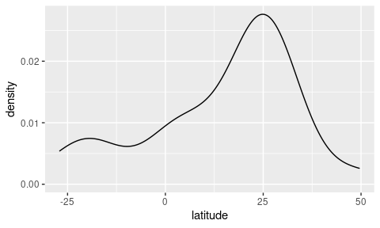

Copepods true colors: astaxanthin pigmentation as an indicator of
fitness
================
Laure Vilgrain - March 2021

# 0. Read data

**Suppl. Data SI.** List of all the publications that discussed and/or
quantified carotenoid pigmentation in copepods

``` r
SI <- read_delim("DataS1_general_info.csv", ";", escape_double = FALSE, trim_ws = TRUE)
SI
```

    # A tibble: 303 × 22
       study             year no    study_type latitude longitude ecosystem altitude
       <chr>            <dbl> <chr> <chr>         <dbl>     <dbl> <chr>        <dbl>
     1 Gorokhova et al.  2013 <NA>  redness a…     59         25  marine          NA
     2 Gorokhova et al.  2013 <NA>  redness a…     59         25  marine          NA
     3 Anderson et al.   2003 <NA>  diet effe…     54         12  marine          NA
     4 Hairston          1976 <NA>  redness a…     47.4     -120. freshwat…      328
     5 Hairston          1976 <NA>  redness a…     47.5     -120. freshwat…      328
     6 Bandaranayake a…  1982 <NA>  pigment i…    -18.5      147  marine          NA
     7 Bandaranayake a…  1982 <NA>  pigment i…    -18.5      147  marine          NA
     8 Bandaranayake a…  1982 <NA>  pigment i…    -18.5      147  marine          NA
     9 Bandaranayake a…  1982 <NA>  pigment i…    -18.5      147  marine          NA
    10 Byron             1982 <NA>  forcing v…     40       -105  freshwat…     3216
    # … with 293 more rows, and 14 more variables: sampling_month <chr>,
    #   genus <chr>, species <chr>, stage <chr>, astaxanthin_or_carotenoids <chr>,
    #   astaxanthin_on_total_car <chr>, asta_form <chr>, concentration <chr>,
    #   unit <chr>, daily_pic_moment <chr>, seasonal_pic_season <chr>,
    #   seasonal_pic_month <chr>, predator_abundance <chr>, comments <chr>

<br/> **Suppl. Data SII.** List of the detailed quantifications of
carotenoids forms in copepods found in 38 articles from the literature

``` r
SII <- read_delim("DataS2_asta_form_detailed.csv", ";", escape_double = FALSE, trim_ws = TRUE)
SII
```

    # A tibble: 38 × 11
       study            year order latitude ecosystem species stage free  all_esters
       <chr>           <dbl> <chr>    <dbl> <chr>     <chr>   <chr> <chr> <chr>     
     1 Anderson et al.  2003 <NA>        54 marine    Acarti… mixed 72    30        
     2 Bandaranayake …  1982 <NA>      -185 marine    Temora… mixed mino… dominant  
     3 Bandaranayake …  1982 <NA>      -185 marine    Centro… mixed mino… dominant  
     4 Bandaranayake …  1982 <NA>      -185 marine    Undinu… mixed mino… dominant  
     5 Bandaranayake …  1982 <NA>      -185 marine    Euchae… mixed domi… minority  
     6 Foss et al.      1987 <NA>        62 marine    Calanu… adul… 11    89        
     7 Goodwin and Sr…  1949 <NA>        53 marine    Tigrio… adul… domi… minority  
     8 Holeton et al.   2009 <NA>        58 marine    Acarti… adul… 55    45        
     9 Juhl et al.      1996 <NA>        32 marine    Calanu… adul… 15    85        
    10 Juhl et al.      1996 <NA>        34 marine    Calanu… adul… 15    85        
    # … with 28 more rows, and 2 more variables: `mono-esters` <dbl>,
    #   `di-esters` <dbl>

<br/> **Suppl. Data SIII.** Abiotic and biotic variables effects on
copepod astaxanthin concentrations from the literature

``` r
SIII <- read_delim("DataS3_forcing_variables.csv", ";", escape_double = FALSE, trim_ws = TRUE)
SIII
```

    # A tibble: 179 × 8
       study       year order condition forcing_variable asta_correlation confidence
       <chr>      <dbl> <chr> <chr>     <chr>            <chr>            <chr>     
     1 Anderson …  2003 <NA>  mesocosm  diet_composition positive         high      
     2 Anderson …  2003 <NA>  mesocosm  diet_quantity    positive         high      
     3 Anderson …  2003 <NA>  mesocosm  feeding_activity positive         high      
     4 Anderson …  2003 <NA>  mesocosm  diurnal_variati… positive         high      
     5 Byron       1982 <NA>  in vivo   lake_elevation   positive         high      
     6 Byron       1982 <NA>  in vivo   lake_depth       negative         high      
     7 Byron       1982 <NA>  in vivo   UV_radiations    negative         high      
     8 Byron       1982 <NA>  in vivo   temperature      negative         high      
     9 Byron       1982 <NA>  in vivo   diet_quantity    none             high      
    10 Byron       1982 <NA>  in vivo   fish_presence    negative         medium    
    # … with 169 more rows, and 1 more variable: comments <chr>

<br/> **Suppl. Data SIV.** List of the effects of carotenoid
pigmentation on fitness-related variables in copepods

``` r
SIV <- read_delim("DataS4_fitness_effects.csv", ";", escape_double = FALSE, trim_ws = TRUE)
SIV
```

    # A tibble: 55 × 11
       study            year  condition forcing_variable response_variable     unit 
       <chr>            <chr> <chr>     <chr>            <chr>                 <chr>
     1 Gorokhova et al. 2013  in vivo   <NA>             Grazing rate          ugC …
     2 Gorokhova et al. 2013  in vivo   <NA>             Egg ratio             egg …
     3 Gorokhova et al. 2013  in vivo   <NA>             RNA:DNA (metabolic i… <NA> 
     4 Gorokhova et al. 2013  in vivo   <NA>             ORAC (Oxygen radical… uM T…
     5 Gorokhova et al. 2013  in vitro  <NA>             % Eaten by predator   prey…
     6 Gorokhova et al. 2013  in vitro  <NA>             Red prey preference … Manl…
     7 Gorokhova et al. 2013  in vitro  <NA>             Grazing rate          ugC …
     8 Gorokhova et al. 2013  in vitro  <NA>             RNA:DNA (metabolic i… <NA> 
     9 Gorokhova et al. 2013  in vitro  <NA>             ORAC (Oxygen radical… uM T…
    10 Hairston         1976  in vitro  UV_radiations    % Survival            <NA> 
    # … with 45 more rows, and 5 more variables: fitness_component <chr>,
    #   fitness_effect <chr>, confidence <chr>, graph_order <dbl>, comments <chr>

<br/> <br/>

# I. Red pigmentation in copepods

## A. Redness: a shared and conserved functional trait in copepods

### *Studies*

``` r
# Counts of all studies 
(SI %>% distinct(study, year, no) %>% nrow())
#-> 84

# Counts of studies with quantification of carotenoids
SI %>% filter(study_type !="no_quantification") %>% distinct(study, year, no)  %>% nrow()
#-> 75

# Ratio between both
(SI %>% filter(study_type !="no_quantification") %>% distinct(study, year, no)  %>% nrow()) / (SI %>% distinct(study, year, no) %>% nrow())
# -> 0.9047619
```

<div style="background-color: #FFFF00">

**84 articles** contain the words ’copepods” and “carotenoid”,
“astaxanthin” or “redness” and among them, **76 (90%) quantified
carotenoids** (in various units and methods).

</div>

### *Genus and species*

``` r
# Number of species
SI %>% group_by(species) %>% summarise() %>% nrow()
# -> 157

# Number of genus
SI %>% filter(genus != "mixed") %>% group_by(genus) %>% summarise() %>% nrow()
# -> 62
```

``` r
# Most studied genus 
SI %>% filter(genus != "mixed") %>% 
  ggplot() + 
  geom_bar(aes(y=fct_rev(fct_infreq(genus))))+
  labs(y="Genus", x= "Number of reported observations")+theme_linedraw(base_size = 10)
```

<div class="figure" style="text-align: center">


<p class="caption">
Counts of studies that observed carotenoid pigmentation in different
copepod genus.
</p>

</div>

Carotenoids were observed in **161 species among 63 genus** (we removed
case where genus are mixed together, noted as “mixed”). We can see that
*Diaptomus* and *Calanus* species are the most studied.

<br/> In some articles, carotenoid pigmentation was just discussed in
the text of the article but not quantified, so we classify the study
type as “no\_quantification” in the “study\_type” column. In other
cases, pigmentation was assessed visually for some tests but no
numerical quantifications were performed. In those cases we put NAs in
the “concentration” column. **For all next analyses, only studies that
quantified carotenoids will be used:**

``` r
SI <- SI %>% filter(study_type !="no_quantification")
SI  %>% distinct(study, year, no, latitude, longitude) %>% nrow()
# -> 133
SI %>% filter(is.na(concentration) == FALSE) %>% distinct(study, year, no, latitude, longitude, altitude, species, stage) %>% nrow()
# -> 262
```

Carotenoids quantifications were reported in **134 locations globally**,
which correspond to **262 measurements of pigments** (combinations
study/latitude/longitude/altitude/species/stages) <br/>

<br/>

### *Units*

``` r
SI  %>% filter(is.na(concentration) == FALSE) %>% group_by(unit) %>% summarise(nb_of_studies_using_this_unit = n()) %>% arrange(-nb_of_studies_using_this_unit) %>% ungroup()
```

    # A tibble: 17 × 2
       unit                                         nb_of_studies_using_this_unit
       <chr>                                                                <int>
     1 ug/mgDW                                                                202
     2 OD/mgdrywt                                                              22
     3 ng.ind-1                                                                19
     4 % of copepod with red antennules                                         8
     5 a*, b* channel color value                                               5
     6 A/mg                                                                     3
     7 ug/mgLW                                                                  3
     8 %red pixel geninal somite, %redness antennae                             2
     9 ng.clutch-1                                                              2
    10 ng.ugC-1                                                                 2
    11 OD/gdrywt                                                                2
    12 mean grey value                                                          1
    13 ng.egg-1                                                                 1
    14 OD/ind                                                                   1
    15 pmol.ind-1                                                               1
    16 ug.egg-1                                                                 1
    17 umol.molC-1                                                              1

Among the **262 quantifications**, the most common unit was **µg/mgDW**:
202 measurements, so only values in µg/mgDW will be kept for
quantitative comparisons. <br/>

### *Freshwater vs marine ecosystems*

``` r
# Filter measurments in µg/mgDW
ug <- SI %>% filter (unit == "ug/mgDW")

# Transform to have numeric values 
ug$concentration <- as.numeric(ug$concentration)

# Count number of studies by ecosystems 
ug %>% group_by(ecosystem) %>% summarise(counts = n(), mean_concentration = mean(concentration), sd = sd(concentration)) %>% ungroup()
```

    # A tibble: 2 × 4
      ecosystem  counts mean_concentration    sd
      <chr>       <int>              <dbl> <dbl>
    1 freshwater     62              2.77   2.71
    2 marine        140              0.439  1.06


Freshwater species have an average carotenoid concentration of **2.77 ±
2.71 µg.mgDW-1 (n=62)** and marine species an average carotenoid
concentration of **0.44 ± 1.06 µg.mgDW-1 (n=140)**.

<br/> <br/>

We performed statisical tests to compare carotenoid mean concentrations
between freshwater and marine ecosystems

``` r
ug$ecosystem = factor(ug$ecosystem, levels = c("freshwater", "marine"))

# First, test of normal distribution of data 
shapiro.test(filter(ug, ecosystem =="freshwater")$concentration)
# -> W = 0.73354, p-value = 2.782e-09
shapiro.test(filter(ug, ecosystem =="marine")$concentration)
# -> W = 0.39528, p-value < 2.2e-16
```

-&gt; concentrations are not normally distributed

``` r
ug$concentration_log10 <- log10(ug$concentration)
# -> log transformation

shapiro.test(filter(ug, ecosystem =="freshwater")$concentration_log10)
# -> W = 0.98474, p-value = 0.6355 : normal distribution for freshwater data
shapiro.test(filter(ug, ecosystem =="marine")$concentration_log10)
# -> W = 0.9587, p-value = 0.0003215
# -> log-transformed marine concentrations are still not normal after transformation

leveneTest( log10(concentration) ~ ecosystem, data = ug, alternative = "two.sided" )
# -> and variances are not equal :
#        Df F value    Pr(>F)    
# group   1  15.819 9.739e-05 ***
```

-&gt; log-transformed marine concentrations were **still not normal, and
variances are not equal**

``` r
# Try to remove data from Fisher, suspected to be outliers ---
noFisher <- ug %>% filter(study != "Fisher et al.")
noFisher$concentration_log10 <- log10(noFisher$concentration)
shapiro.test(filter(noFisher, ecosystem =="freshwater")$concentration_log10)
# -> W = 0.98474, p-value = 0.6355 : normal distribution
shapiro.test(filter(noFisher, ecosystem =="marine")$concentration_log10)
# W = 0.98338, p-value = 0.6206 : normal distribution
leveneTest( log10(concentration) ~ ecosystem, data = noFisher, alternative = "two.sided" )
# -> but variances still not equal, Welch transformation needed
t.test(log10(concentration) ~ ecosystem, data = noFisher, alternative = "two.sided")
# -> t.test : freshwater and marine concentration are significantly different
```

-&gt; we tried to **remove data from Fisher et al.**, suspected to be
outliers. Distributions were then normal and freshwater and marine
carotenoid concentrations **significantly different**. However, **we
decided to keep all the complete dataset** with data from Fisher et
al. (83 points more, many different species) and **use a non-parametric
test:**

``` r
# So we can use a non-parametric test: 
wilcox.test(filter(ug, ecosystem =="marine")$concentration_log10, filter(ug, ecosystem =="freshwater")$concentration_log10, alternative = "two.sided")
```


        Wilcoxon rank sum test with continuity correction

    data:  filter(ug, ecosystem == "marine")$concentration_log10 and filter(ug, ecosystem == "freshwater")$concentration_log10
    W = 555.5, p-value < 2.2e-16
    alternative hypothesis: true location shift is not equal to 0

``` r
# -> significantly different 
```

Freshwater and marine carotenoid concentrations are **significantly
different** using a Wilcoxon rank sum test. We can then observe mean
concentration differences between copepod genus:

<div class="figure" style="text-align: center">


<p class="caption">
Figure S1. Carotenoid concentration (µg/mgDW) in different freshwater
and marine copepod genus. Color represent the number of studies that
were used to compute the mean carotenoid content.
</p>

</div>

<br/>

Plenty of copepod genus have the availability to synthesize astaxanthin
but their propensity to do so seems mediated by the environment where
they live. Note that then marine species accumulating the more pigments
are *Tigriopus sp.* living in shallow temperate waters (ex: tidal pools
of rocky shores) and *Calanus spp.* living in arctic and subarctic
waters, submitted to strong seasonal climate variations.

<br/>

## B. Localisation, molecular forms and metabolism of carotenoids pigments

### *Copepods’ carotenoids types (astaxanthin, canthaxanthin, etc)*

``` r
# Number of studies that quantified the different types of carotenoids in copepods
detailed_carotenoids <- SI %>% filter(!is.na(astaxanthin_on_total_car)) 
detailed_carotenoids %>% group_by(study, year, no) %>% summarise(obs = n()) %>% nrow()
# -> 30 studies 

asta_car <- SI %>% group_by(astaxanthin_on_total_car) %>% summarise(counts = n())
sum(asta_car$counts) # on a total of 291 observations
asta_car <- asta_car %>% filter(!is.na(astaxanthin_on_total_car)) # remove NA
sum(asta_car$counts) 
# -> 166 observations with detailed information about carotenoids and 125 observations without detailed information about carotenoids

# For these 30 studies and over 166 quantification, distinguishing  observations of astaxanthin in minority (<50%) or majority(>50%)
  # Characters strings : 
min1 <- filter(asta_car, astaxanthin_on_total_car == "minority")
dom1 <- filter(asta_car, astaxanthin_on_total_car == "dominance")

  # Numerical values (remove characters)
asta_car <- asta_car %>% filter(astaxanthin_on_total_car!= "minority" & astaxanthin_on_total_car != "dominance")
asta_car$astaxanthin_on_total_car <- as.numeric(asta_car$astaxanthin_on_total_car)
dom2<- asta_car %>% filter(astaxanthin_on_total_car >= 50)
min2 <- asta_car %>% filter(astaxanthin_on_total_car < 50)

  # Bind into dataframes in order to count
dom <- rbind(dom1, dom2)
min <- rbind(min1, min2)
sum(dom$counts) / 166 *100
sum(min$counts) / 166 *100
# -> in 96%, astaxanthin was dominant (and really often largly dominant : >90% of copepod carotenoids) - 160 quantification 
# -> in ~4%, astaxanthin was in a minority or <60% of carotenoids - 6 quantifications 

# Canthaxanthin : 
asta_cantha <- SI %>% filter(str_detect(comments, "canthaxanthin")) %>% select(study, year, no, comments) # if authors mentioned canthaxanthin in one observation, we always reported it in the column "comments" of the dataset
setdiff(asta_cantha$study, detailed_carotenoids$study) # coherently, all studies that mentioned canthaxantin (9) are studies that have detailed all the carotenoids of copepods (30)
nrow(asta_cantha %>% group_by(study, year, no) %>% summarise(n()))
nrow(asta_cantha)
nrow(asta_cantha) / 166 *100
# -> canthaxanthin was found in only 9 studies (21 observations, 13% of cases), and almost everytime in "negligible amounts, traces or <5%"
```

**Thirty studies** provide a detailed description of carotenoid pigments
molecular forms for various species and developmental stages (166
measurements). In **96% (160 quantifications), astaxanthin was
dominant** (or &gt;50%), in \~5% (6 quantifications) of the cases,
astaxanthin was in a minority or &lt;50% of carotenoids. **Canthaxanthin
was found in only 9 studies** (21 observations, 13% of cases), and
almost every time in “negligible amounts, traces or &lt;5%”.

<br/>

### *Astaxanthin forms*

``` r
# Number of studies that detailed astaxanthin forms (free, mono and di-esters)
nrow(SII) # 38 detailed observations of astaxanthin forms
distinct(SII, study, year, order) # 18 studies

# Character strings : 
free_dom_est_min1 <- SII %>% filter(free == "dominant" & all_esters == "minority")
nrow(free_dom_est_min1) # Free form dominant and esters in minority: 7 obs
free_min_est_dom1 <- SII %>% filter(free == "minority" & all_esters == "dominant")
nrow(free_min_est_dom1) # Ester form dominant and free form in minority: 3 obs

# Remove charcter strings to have only numerical values
SII <- SII %>% filter(free != "dominant" & free != "minority")
SII$free <- as.numeric(SII$free)
SII$all_esters <- as.numeric(SII$all_esters)
free_dom_est_min2 <- SII %>% filter(free >= 50)
nrow(free_dom_est_min2) # Free form >= 50%: 16obs
free_min_est_dom2 <- SII %>% filter(free < 50)
nrow(free_min_est_dom2) # Free form < 50%: 12obs

free_dom_est_min <- rbind(free_dom_est_min1, free_dom_est_min2)
free_min_est_dom <- rbind(free_min_est_dom1, free_min_est_dom2 )

nrow(free_dom_est_min) / 38 * 100  
# -> in 61% of cases, free astaxanthin is dominant
nrow(free_min_est_dom)  / 38 * 100
# -> in 39% of cases astaxanthin esters are dominant

# Look at the proportions of mono- and di-esters
rbind(free_dom_est_min2, free_min_est_dom2) %>% 
  filter(!is.na(`mono-esters`)) %>% 
  select(- all_esters) %>% 
  gather(key = "asta_form", value = "percent" , "free", `mono-esters`,`di-esters`) %>% 
  group_by(asta_form) %>% 
  summarise(mean_percent = mean(percent))
# -> very detailed analyses (8 quantification from 7 studies) show that on average, 53% of astaxanthin is in the free form, 27% of astaxanthin is in mono-esters and 20% is di-ester. 
```

**18 studies** provided detailed forms of carotenoids (38 observations).
In **61%** of cases, **free astaxanthin is dominant**, and in **39%** of
cases **esters are dominant**. Very detailed analyses (8 quantifications
from 7 studies) show that on average, 53% of astaxanthin is in the free
form, 27% of astaxanthin is in mono-esters and 20% is di-ester.

<br/>

### *Ontogenic development*

This graphic illustrates that we don’t have enough study that quantified
carotenoid concentration along ontogenic development. We can not
conclude about carotenoid quantities and forms according to copepod
stages. <br/>

<div class="figure" style="text-align: center">


<p class="caption">
Carotenoid concentrations in copepod stages from three different
studies. Points are colored according to the unit used.
</p>

</div>

# II. Effects of abiotic and biotic forcings on astaxanthin concentrations in copepods

## A. Environmental controls on pigmentation

### *Altitude*

``` r
test_marine <- ug %>% filter(ecosystem == "marine") %>% mutate(lat_abs= abs(latitude))
test_freshwater <- ug %>% filter(ecosystem == "freshwater") %>% mutate(lat_abs= abs(latitude))
```

``` r
ug  %>% filter(ecosystem=="freshwater") %>% ggplot() + 
  geom_point(aes(altitude, log10(concentration)), color="grey40") + 
  geom_smooth(aes(altitude, log10(concentration)), method = "lm", color="black")+
  labs(x="Lake altitude asl. (m)", y=" Carotenoid content (µg/mgDW) 
- log10 transformation")+
  theme_bw(base_size = 10)
```

<div class="figure" style="text-align: center">


<p class="caption">
Figure S2. Carotenoid concentration (µg/mgDW, log-transformed) according
to lake altitude (m) with a linear model fitted (significant, p-value
&lt; 0.001).
</p>

</div>

``` r
model <- lm(log10(test_freshwater$concentration)~test_freshwater$altitude)
summary(model)
```


    Call:
    lm(formula = log10(test_freshwater$concentration) ~ test_freshwater$altitude)

    Residuals:
         Min       1Q   Median       3Q      Max 
    -0.98737 -0.26315 -0.03608  0.23042  0.70859 

    Coefficients:
                              Estimate Std. Error t value Pr(>|t|)    
    (Intercept)              1.533e-01  5.701e-02   2.689 0.009300 ** 
    test_freshwater$altitude 9.233e-05  2.627e-05   3.514 0.000854 ***
    ---
    Signif. codes:  0 '***' 0.001 '**' 0.01 '*' 0.05 '.' 0.1 ' ' 1

    Residual standard error: 0.3511 on 59 degrees of freedom
      (1 observation deleted due to missingness)
    Multiple R-squared:  0.1731,    Adjusted R-squared:  0.1591 
    F-statistic: 12.35 on 1 and 59 DF,  p-value: 0.0008538

``` r
par(mfrow=c(2,2)) 
plot(model)
```


There is a **significant relationship between carotenoids content and
altitude of lakes, p-value &lt; 0.001**. However, we see a lot of noise
(R square = 0.16) that could be explain by variations of other abiotic
variables (temperature, lake depth, water turbidity) and biotic
variables (phytoplanktonic community, predators, disponibility of other
UV protectants). <br/>

### *Latitude*

``` r
summary(lm(log10(test_marine$concentration)~test_marine$lat_abs))
```


    Call:
    lm(formula = log10(test_marine$concentration) ~ test_marine$lat_abs)

    Residuals:
         Min       1Q   Median       3Q      Max 
    -2.92702 -0.40118  0.03739  0.49310  1.84248 

    Coefficients:
                         Estimate Std. Error t value Pr(>|t|)   
    (Intercept)         -0.939335   0.280261  -3.352  0.00104 **
    test_marine$lat_abs  0.000227   0.005285   0.043  0.96580   
    ---
    Signif. codes:  0 '***' 0.001 '**' 0.01 '*' 0.05 '.' 0.1 ' ' 1

    Residual standard error: 0.781 on 138 degrees of freedom
    Multiple R-squared:  1.337e-05, Adjusted R-squared:  -0.007233 
    F-statistic: 0.001845 on 1 and 138 DF,  p-value: 0.9658

``` r
summary(lm(log10(test_freshwater$concentration)~test_freshwater$lat_abs))
```


    Call:
    lm(formula = log10(test_freshwater$concentration) ~ test_freshwater$lat_abs)

    Residuals:
         Min       1Q   Median       3Q      Max 
    -1.10779 -0.28073 -0.01087  0.24964  0.83077 

    Coefficients:
                             Estimate Std. Error t value Pr(>|t|)   
    (Intercept)              0.579777   0.190978   3.036  0.00355 **
    test_freshwater$lat_abs -0.006296   0.003916  -1.608  0.11312   
    ---
    Signif. codes:  0 '***' 0.001 '**' 0.01 '*' 0.05 '.' 0.1 ' ' 1

    Residual standard error: 0.3779 on 60 degrees of freedom
    Multiple R-squared:  0.04131,   Adjusted R-squared:  0.02533 
    F-statistic: 2.585 on 1 and 60 DF,  p-value: 0.1131

``` r
ug  %>% 
  ggplot() + 
  geom_point(aes(abs(latitude), log10(concentration), color = ecosystem))+ 
  geom_smooth(aes(abs(latitude), log10(concentration), group = ecosystem, color = ecosystem), method = lm)+
  scale_color_manual(values=c("#7fc97f","#0868ac"))+
  theme_bw(base_size = 10)+
  labs(y= "Carotenoid content (µg/mgDW)
  - log10 transformation ", x="Latitude (°) in absolute value", color = "Ecosystem")
```

<div class="figure" style="text-align: center">


<p class="caption">
Figure S3. Carotenoid concentration (µg/mgDW, log-transformed) according
to latitude (° in absolute value) in freshwater and marine ecosystems.
Linear models are fitted but are not significant.
</p>

</div>

**Carotenoids content shows no relationship with latitude, neither in
freshwater nor in marine environments.** In fact, concentration
variations within a study (or a species) are often more important than
variations according to latitude. </br>

<br/>

## B. Biological and metabolic drivers of pigmentation

### *Seasons*

``` r
SI %>% filter(is.na(seasonal_pic_season) == FALSE) %>% select(study, year, no, seasonal_pic_season) %>% group_by(seasonal_pic_season) %>% summarise(count = n()) %>% mutate(tot = sum(count), percent = count/tot*100) %>% select(-tot)
```

    # A tibble: 4 × 3
      seasonal_pic_season count percent
      <chr>               <int>   <dbl>
    1 autumn                  1    2.70
    2 no                      4   10.8 
    3 spring                 15   40.5 
    4 winter                 17   45.9 

On **37 time series**, astaxanthin content showed seasonal patterns with
**maxima in winter (45%) or in spring (40%)** or in automn (3%). In 10%
of the cases, no seasonal maxima were observed.

<br/>

## C. Impacts of intra- and inter-species interactions on pigmentation

### *Predation in lakes*

``` r
ug$predation = ifelse(ug$predator_abundance=="null", "no", "yes")

ug  %>% filter(ecosystem=="freshwater") %>%  group_by(predation) %>% summarise(n())
```

    # A tibble: 3 × 2
      predation `n()`
      <chr>     <int>
    1 no           22
    2 yes          33
    3 <NA>          7

``` r
# -> predator presence: 33 yes, 18 no

ug  %>% filter(ecosystem=="freshwater" & is.na(predation)== FALSE) %>% 
  ggplot() + 
  geom_boxplot(aes(predation, concentration)) + 
  geom_point(aes(predation, concentration, color=altitude)) +
  scale_color_viridis_c()+
  scale_y_continuous(trans='log10')+
  labs(y="Carotenoid contents (ug/mgDW) 
- log10 transformation", color = "Altitude (m. asl)", x= "Predation")+
  theme_bw(base_size = 10)
```

<div class="figure" style="text-align: center">


<p class="caption">
Figure S4. Distribution of carotenoid concentrations (µg/mgDW,
log-transformed) from lakes with and without predator presence.
Carotenoid concentration difference according to predator presence is
alomost significant (Wilcoxon test, p-value = 0.05014)
</p>

</div>

``` r
#Test comparison predation/no predation (<30)
df_fish <- ug %>% filter(predation == "yes" | predation == "no") %>% mutate(predation = as.factor(predation))

#Normality ? 
shapiro.test(log10(filter(df_fish, predation =="yes")$concentration))
# W = 0.90082, p-value = 0.005596 -> normal distribution
shapiro.test(log10(filter(df_fish, predation =="no")$concentration))
# W = 0.92556, p-value = 0.09914 -> not normal distribution
```

Because n&lt;30 and data not normaly distributed, we use a
**non-parametric test** to compare carotenoid concentrations between
lakes **with or without predators**:

``` r
wilcox.test(concentration ~ predation, data = df_fish)
```


        Wilcoxon rank sum test with continuity correction

    data:  concentration by predation
    W = 477.5, p-value = 0.05014
    alternative hypothesis: true location shift is not equal to 0

``` r
df_fish %>% group_by(predation) %>% summarise(mean(concentration))
```

    # A tibble: 2 × 2
      predation `mean(concentration)`
      <fct>                     <dbl>
    1 no                         3.35
    2 yes                        2.12

We are **really close to the significance threshold (p-value =
0.05014)** for the Wilcocxon rank sum test to compare pigment content
between lakes **with** (mean carotenoid concentration = **2.12 µg/mgDW,
n=33**) and **without fish** (mean carotenoid concentration = **3.35
µg/mgDW, n = 22**). Altitude could play a role inside each category :
high altitude lakes or ponds without fish can also be shallow and
exposed to strong light radiations.

<br/>

``` r
wilcox.test(concentration ~ predation, data = df_fish)
```


        Wilcoxon rank sum test with continuity correction

    data:  concentration by predation
    W = 477.5, p-value = 0.05014
    alternative hypothesis: true location shift is not equal to 0

``` r
df_fish %>% group_by(predation) %>% summarise(mean(concentration))
```

    # A tibble: 2 × 2
      predation `mean(concentration)`
      <fct>                     <dbl>
    1 no                         3.35
    2 yes                        2.12

We are **really close to the significance threshold (p-value =
0.05014)** for the Wilcocxon rank sum test to compare pigment content
between lakes **with** (mean carotenoid concentration = **2.12 µg/mgDW,
n=33**) and **without fish** (mean carotenoid concentration = **3.35
µg/mgDW, n = 22**). Altitude could play a role inside each category :
high altitude lakes or ponds without fish can also be shallow and
exposed to strong light radiations.

<br/>

### *Summary of all abiotic and biotic drivers*

``` r
# Change astaxanthin evolution column into factor
SIII$asta_correlation <- factor(SIII$asta_correlation, levels =c("positive","none", "negative"), ordered = TRUE)

# Replace names to have a more lisible figure 
SIII$forcing_variable <- SIII$forcing_variable %>% 
  str_replace_all(c("diet_composition" = "A. Diet quality", "feeding_activity" = "B. Feeding", "diet_quantity" = "C. Diet Quality", "fish_presence" = "D. Predator", "diurnal_variations" = "E. Daily cycle", "UV_radiations" = "F. UV", "natural_light" = "G. Natural light", "UV_fish" = "H. UV + Predator", "latitude_discrete" = "I. Latitude", "individual_depth" = "J. In situ depth", "ice_cover" = "K. Ice cover", "temperature" = "L. Temperature", "lake_elevation" = "M. Lake altitude", "dissolved_organic_carbon" = "N. DOC", "copper"= "O. Copper", "lake_depth" = "P. Lake depth", "egg_ratio"= "Q. Egg ratio", "body_length" = "R. Body length", "lipid_content" = "S. Lipid content", "MAAs" = "T. MAAs", "removal of UV radiations" = "U. UV removal"))
  
  
# Count the number of times a forcing variables was statistically tested according to carotenoid concentrations through a positive, negative or absent correlation:
SIII_grouped <- SIII %>%
  group_by(forcing_variable) %>% 
  mutate(n=n()) %>% 
  filter(n>=2) %>% 
  ungroup() %>% 
  group_by(forcing_variable, asta_correlation) %>% 
  summarise(counts=n()) %>% 
  ungroup()
  
SIII_grouped %>% 
  filter(forcing_variable != "U. UV removal" & forcing_variable != "UV_temp") %>% #because these 2 variables are to difficul to interpret without context 
  ggplot() + 
  facet_wrap(~forcing_variable, ncol = 4)+
  geom_bar(aes(x=asta_correlation, y=counts, fill=asta_correlation), stat="identity")+
  labs(x = "Types of correlation between various forcing 
    variables and individual carotenoid content:", y= "Counts of tested correlations in the litterature", fill = "Correlation")+
  scale_fill_manual(values=c("#238b45", "#91bfdb", "#990000"))+
  theme_bw(base_size = 12)+
  theme(strip.background = element_rect(colour="black", fill="white", linetype="solid"),
        axis.text.x = element_blank(), legend.position="bottom", legend.box = "horizontal",
         legend.title = element_blank(), legend.text = element_text(size = 12))
```

<div class="figure" style="text-align: center">


<p class="caption">
Figure 4. Counts of correlations between copepod carotenoid pigmentation
and main environmental, biological or ecological forcings tested in the
litterature.
</p>

</div>

# III. How does redness impact copepod fitness (reproduction, growth, survival) ?

``` r
# If we keep the whole dataset : 
SIV %>% 
  group_by(fitness_effect) %>%
  summarise(n=n(), percent = n()/(33+13+9))
```

    # A tibble: 3 × 3
      fitness_effect     n percent
      <chr>          <int>   <dbl>
    1 favorable         33   0.6  
    2 neutral           13   0.236
    3 unfavorable        9   0.164

``` r
# 9 negative (16%), 13 neutral (24%) and 33 positive effects (60%). 
```

If we keep the whole dataset (SIV), we can find 9 negative (16%), 13
neutral (24%) and 33 positive effects (60%) of carotenoid pigmentation
on copepod fitness. However, we decided to **remove data tagged with
“low confidence”** (weak statistical tests or poor data quality
discussed in the text of the article, see column “comments” of SIV for
more details).

<br/>

``` r
# However, we can remove points with "low" confidence, (bad statistics or data quality discussed in the text)
SIV %>% filter(confidence != "low") %>% 
  group_by(fitness_effect) %>%
  summarise(n=n(), percent = n()/(31+11+8))
```

    # A tibble: 3 × 3
      fitness_effect     n percent
      <chr>          <int>   <dbl>
    1 favorable         31    0.62
    2 neutral           11    0.22
    3 unfavorable        8    0.16

``` r
# 8 negative effects (16%), 11 neutral (22%), 31 positive effects (62%)

# If we look in particular to survival and mortality curves : 
SIV %>% filter(str_detect(response_variable, "Survival") | str_detect(response_variable, "Mortality")) %>% 
  group_by(fitness_effect) %>%
  summarise(n=n(), percent = n()/21)
```

    # A tibble: 3 × 3
      fitness_effect     n percent
      <chr>          <int>   <dbl>
    1 favorable         15  0.714 
    2 neutral            5  0.238 
    3 unfavorable        1  0.0476

Out of **50 statistically tested** effects on one fitness variable, red
pigmentation was **unfavorable for 8 (16%), neutral for 11 (22%), and
favorable in 31 cases (62%)**. If we look in particular to survival and
mortality curves, when copepods are in general submitted to an external
stressor, we can see that carotenoid pigmentation is favorable in **71%
of the cases**.

<br/>

### *Counts of redness effects on various fitness variables*

``` r
# Counts by fitness effect, arrange by fitness component (growth, survival or reproduction)
SIV_grouped <- SIV %>%
  filter(response_variable != "NA")%>%
  filter(confidence!= "low") %>% 
  group_by(fitness_effect, response_variable, graph_order,fitness_component) %>%
  summarise(n=n()) %>% 
  ungroup()%>%  
  spread(key=fitness_effect, value= n) %>% 
  arrange(-graph_order)

# Create a factor to have variables in a good order on the graphic (according to fitness component and discussion order in the body of the article)
SIV_grouped <- SIV_grouped %>%  mutate(index= as.factor(seq(1:nrow(SIV_grouped))))

# Favorable ---
fav <- SIV_grouped %>% select(response_variable, favorable, index, fitness_component) #keep only postive to have a color scale by effect type
fav$favorable <- as.factor(fav$favorable) # transform as factor to have the best color scale
green <- c("#41ae76", "#238b45", "#006d2c","#00441b") #because 4 levels

pfav <- ggplot(fav, aes(y = index, x= "", fill = favorable))+
  geom_tile()+
  scale_fill_manual(values=green, na.value = "white", na.translate = F)+
  scale_y_discrete(labels=fav$response_variable)+
  labs(y="Fitness response variables", title = "Favorable - 31 cases (62%)")+
  theme_minimal(base_size = 15)+
  theme(legend.position="bottom",   axis.title.x = element_blank(), legend.title = element_blank(), legend.text = element_text(size = 15))

# Neutral ---
neu<- SIV_grouped %>% select(response_variable, neutral, index) #keep only postive to have a color scale by effect type
neu$neutral<- as.factor(neu$neutral) # transform as factor to have the best color scale
blue <- c("#a6bddb", "#74a9cf", "#3690c0") #because 3 levels

pneu <- ggplot(neu, aes(y = index, x = "", fill = neutral))+
  geom_tile()+
  scale_fill_manual(values=blue, na.value = "white", na.translate = F)+
  theme_minimal(base_size = 15)+
  labs(x= "Redness effects on copepod fitness - counts of tested observations:", title = "Neutral - 11 cases (22%)")+
  scale_y_discrete(labels=element_blank())+
  theme(legend.position="bottom", legend.title = element_blank(),  axis.title.y = element_blank(), legend.text = element_text(size = 15))

# Unfavorable ---
unfav<- SIV_grouped %>% select(response_variable, unfavorable, index) #keep only positive to have a color scale by effect type
unfav$unfavorable <- as.factor(unfav$unfavorable) # transform as factor to have the best color scale
red <- c("#ef3b2c", "#cb181d","#a50f15") #because 3 levels

punfav <- ggplot(unfav, aes(y = index, x = "", fill = unfavorable))+
  geom_tile()+
  scale_fill_manual(values=red, na.value = "white", na.translate = F)+
  theme_minimal(base_size = 16)+
  scale_y_discrete(labels=element_blank())+
  labs(fill = "", title = "Unfavorable - 8 negative cases (16%)") +
  theme(legend.position="bottom", axis.title.y = element_blank(), axis.title.x = element_blank(), legend.title = element_blank(), legend.text = element_text(size = 18))


pfav | pneu | punfav
```

<div class="figure" style="text-align: center">


<p class="caption">
Figure 5. Carotenoid pigmentation effects on reproduction, growth and
survival of copepods.
</p>

</div>
